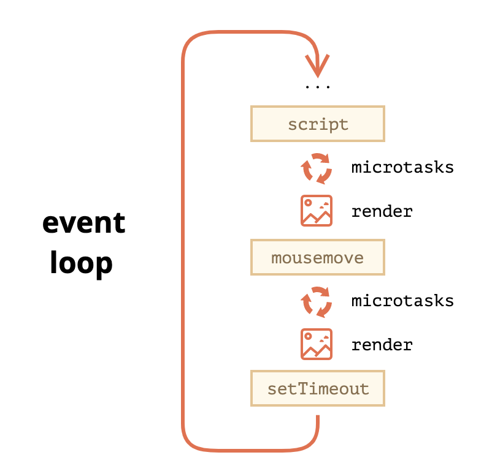

## JS

### promise

#### promise 原理

promise 的实现原理就是使用回调函数，当调用 then 方法时，将回调函数收集在 promise 内部，执行 resovle 时去依次执行收集的回调数组

#### promise 实现

```js
class Promise {
  callbacks = [];
  state = "pending"; //增加状态
  value = null; //保存结果
  constructor(fn) {
    fn(this._resolve.bind(this));
  }
  then(onFulfilled) {
    if (this.state === "pending") {
      //在resolve之前，跟之前逻辑一样，添加到callbacks中
      this.callbacks.push(onFulfilled);
    } else {
      //在resolve之后，直接执行回调，返回结果了
      onFulfilled(this.value);
    }
    return this;
  }
  _resolve(value) {
    this.state = "fulfilled"; //改变状态
    this.value = value; //保存结果
    this.callbacks.forEach((fn) => fn(value));
  }
}
```

#### promise all 实现

1. 作用

- 需要请求多个 api 并且有执行顺序时，因为 promise.all 返回的结果和传入的的顺序是一致的
- 提高请求速度

2. 实现
   首先，promise.all 接受一个 promise 数组，定义一个变量存储 promise 数组的长度，然后返回一个 promise，在这个 promise 中循环 promise 数组调用其 then 方法，如果抛错则直接执行返回 promise 的 reject 回调。
   反之定一个数组收集到所有的 resolve，记录成功返回数，当 count 等于接受的 promise 数组时调用 resolve 返回结果数组

#### 执行顺序

[promise 执行顺序](https://www.jianshu.com/p/910e22a3ba18)

### setTimeout

- 最短时间间隔不得低于 4ms，老版本为 10ms
- 对于 dom 变动，重新渲染的部分通常不会立即执行，每 16ms 执行一次
- requestAnimationFrame 的效果好于 setTimeout

- setTimeout 只是将事件插入了“任务队列“，必须等到当前代码（执行栈内部的同步代码）的执行结束，主线程才会去执行它的回调函数，因此如果当前代码执行时间很长，setTimeout 的回调函数就得继续等待，所以是无法保证准时执行的

### event loop

- 事件循环
  首先是脚本，然后是微任务，渲染等



- 每个宏任务之后，引擎会立即执行微任务队列中的所有任务，然后再执行其他的宏任务，或渲染，或进行其他任何操作

- 微任务会在执行任何其他事件处理，或渲染，或执行任何其他宏任务之前完成

首先会执行栈中的代码，同步任务，就是全局的同步代码，其他的点击事件，以及 ajax 请求、setTimeout 等等异步任务将会进入任务队列中等待，当执行栈的任务执行完毕之后，会从任务队列中按照先进先出的原则执行。当一个宏任务执行完毕之后，会清空所有的微任务，然后再读取下一个宏任务，反复如此。

- 点击事件会先被加入任务队列？异步任务在其后？
- 异步队列存放宏任务和微任务吗？
- 微任务是有别的队列吗？
- 只有同步任务和异步任务，异步任务是指不进入主线程，而进入任务队列的任务，那异步的宏任务和微任务在队列中怎么排列的？以怎样顺序加入任务队列的？

js 是一个单线程的，异步和多线程的实现是通过 event loop 事件循环机制来实现的。首先是从全局的同步代码一行一行的压入执行栈中执行，当遇到 setTimeout 等属于宏任务的异步代码时，将其添加到消息队列（Message Queue）中；当遇到 promise 等微任务的异步代码时，将其添加到微任务队列（Microtask Queue）中；执行完执行栈中的同步代码之后，会先清空 Microtask Queue 内的代码，然后再从 Message Queue 中读取一个事件执行

#### 宏任务

- setInterval
- setTimeout

#### 微任务

- new Promise
- new MutaionObserver

### 函数柯里化

### 防抖

- 函数防抖

  - 就是指触发事件后，在 n 秒后只能执行一次，如果在 n 秒内又触发了事件，则会重新计算函数的执行时间
  - 简单点说就是在一段时间内只执行最后一次
    - 🌰 坐公交，司机需要等最后一个人进入才能关门。每次进入一个人，司机就会多等待几秒再关门
  - 解决某些频繁执行的事件，比如点击事件，滚动事件等等

- 应用场景
  - 搜索框搜索输入，只需要用户最后一次输入完再发送请求
  - 手机号、邮箱格式的输入验证检测
  - 窗口大小的 resize ，只需窗口调整完成后，计算窗口的大小，防止重复渲染

```js
function debounce(callback, delay) {
  let timer = null;
  return () => {
    if (timer) {
      clearTimeout(timer);
    }
    timer = setTimeout(callback, delay);
  };
}
```

```js
/**
 * 优化代码
 *    1. 修改通过debounce处理后的函数的this指向为调用时所处的环境的this
 *    2. 传递参数
 */
function debounce(callback, delay) {
  let timer = null;
  // 修改为function声明形式，否则this指向debounce内部this
  return function () {
    // 保存实际调用返回函数时传递的参数
    const arg = arguments;
    // 保存this
    const _this = this;
    if (timer) {
      clearTimeout(timer);
    }
    // 使用apply改变this指向为 callback 实际调用的环境，传递参数
    timer = setTimeout(() => callback.apply(_this, arg), delay);
  };
}

// 使用
const fn = debounce(function (xx) {
  console.log(xx, this);
}, 1000);
btn.onclick = function () {
  // 需要使用call改变this指向，否则此时是在window下直接调用的
  fn.call(this, "xxx");
};
```

- 优化
  - 由于箭头函数没有 this 和 arguments，因此可以简略一些代码

```js
function debounce(callback, delay) {
  let timer = null;
  return function () {
    if (timer) {
      clearTimeout(timer);
    }
    timer = setTimeout(() => {
      callback.apply(this, arguments);
    }, delay);
  };
}
```

### 节流

- 函数节流

  - 限制一个函数在一定时间内只能执行一次
    - 🌰 过地铁/火车闸机时，每个人进入后 3 秒后门关闭，等待下一个人进入

- 应用场景
  - 滚动加载，加载更多或滚动到底部监听
  - 谷歌搜索框，搜索联想功能
  - 高频点击提交，表单重复提交
  - 省市信息对应字母快速选择

```js
function throttle(callback, delay) {
  let timer = timer;

  return function () {
    if (timer) {
      return;
    }
    timer = setTimeout(() => {
      callback();
      timer = null;
    }, delay);
  };
}
```

```js
// 优化this指向和传参

function throttle(callback, delay) {
  let timer = timer;

  return function () {
    const args = arguments;
    const _this = this;
    if (timer) {
      return;
    }
    timer = setTimeout(() => {
      callback.apply(this, args);
      timer = null;
    }, delay);
  };
}
```

### 防抖和节流对比

- 共同点
  - 都是一段时间内只执行一次函数
- 不同点
  - 防抖在一段时间内只执行最后一次，一但此事件被连续执行，会清除之前开启的定时器，重新开启新的定时器
  - 节流在一段时间内只执行第一次，当事件被连续执行时，只有第一次进入函数是会开启定时器，之后一段时间内判断定时器已开启，就会直接 return，直到第一次执行完毕，清除了定时器 id 才会重新执行
  - 因此，防抖和节流的效果对比，当连续点击 btn 执行函数时，防抖是只有在停止点击之后一段时间之后执行函数；而节流在连续点击时是以设置的 delay 时间为间隔，连续执行函数，停止点击后执行完最后一段时间内的一次函数则不在执行

### 深拷贝/浅拷贝

#### 浅拷贝

- =
- {...object}
- Object.assign(target, ...sources)

#### 深拷贝

- 代码最少，性能最差，有缺陷
  - 只有能正确处理 Number, String, Boolean, Array, 扁平对象，RegExp 对象无法拷贝（拷贝成空对象{}），function 也不行，直接拷贝不了这个属性

```js
function deepCopy(obj) {
  return JSON.parse(JSON.stringify(obj));
}
```

- 简洁版，for in 性能略差

```js
function deepCopy(obj) {
  const newObj = Array.isArray(obj) ? [] : {};
  if (typeof obj !== "object") {
    return obj;
  }
  for (let key in obj) {
    newObj[key] = deepCopy(obj[key]);
  }
  return newObj;
}
```

### call/apply

- call 和 apply

### 实现 setInterval

```js
function mySetInterval(callback, delay) {
  setTimeout(() => {
    callback();
    mySetInterval(callback, delay);
  }, delay);
}
```

### 原型链

- instanceof 怎么判断类型的

#### prototype

- 属性为什么要挂载在原型链上

### 继承

- 有哪些继承方式
- 为什么舍弃原来的继承方式
- es5 实现继承
- prototype 继承的缺陷

#### 继承方式

```js
// 父类
function Person(name) {
  this.name = name;
  this.say = function () {
    console.log("I am " + name);
  };
}
Person.prototype.age = "10";
```

1. 原型链继承

- 优点
  - 继承属性：父类的私有属性，父类的原型属性
- 缺点
  - 无法向父类的构造函数传参
  - 继承单一
  - 不管是父类的实例私有属性还是原型上的公有属性统统被设置成了子类原型上的公有熟悉
  - 所有实例共享父类实例的属性，因为子类 Per 的原型上的属性是子类实例共享的，一个实例修改了原型上的属性，所有实例继承的这个属性都被修改了

```js
function Per() {
  this.name = "per";
}
Per.prototype = new Person();
const p = new Per("tom");
```

- 此种继承方法会导致子类直接修改到父类的公有属性

```js
Per.prototype = Person.prototype;
```

2. 使用构造函数继承

- 优点
  - 可以在子类中向父类传参
  - 解决了原型链继承的缺点：无法传参、继承单一，属性共有问题
- 缺点
  - 只继承了构造函数 Person 的私有属性，无法继承 Person 原型 prototype 的公有属性
  - 每次都要重新调用，无法实现构造函数的复用
  - 每个子实例都相当于去拷贝一份父类 Person 的副本，比较臃肿

```js
function PerCall() {
  // 使用call传递PerCall创建的实例给Person，相当于去做了一遍this.xxxx的赋值操作，拷贝了一份Person实例的属性
  Person.call(this, "percall");
}
```

3. 组合继承

- 优点
  - 可以传参、可复用
  - 父类的私有属性在子类中还是私有属性
- 缺点
  - 调用了两次父类 Person 的构造函数
  - Person.call 已经设置过的私有属性，在 prototype 上又被 new 父类的实例再次挂载到了子类的原型上

```js
function PerAll(name) {
  Person.call(this, name);
}
PerAll.prototype = new Person();
```

- 解决组合式继承原型上多一份父类 Person 的私有属性问题

```js
function Fn() {}
Fn.prototype = Person.prototype;
PerAll.prototype = new Fn();
```

4. 原型式继承

- 特点
  - 所有实例都会继承原型链上的属性
  - Object.create()的原理
- 缺点
  - 无法实现复用

```js
function Extends(obj) {
  function Fn() {}
  Fn.prototype = obj;
  return new Fn();
}
const p = new Person();
const p4 = Extends(p);
```

5.

### super

### 基础知识

#### 字符串方法

- slice(start, end) 切割字符串，不包含 end
- substr(start, end) 切割字符串，包含 end

### 迭代器

### async/await

- 它是什么的语法塘
