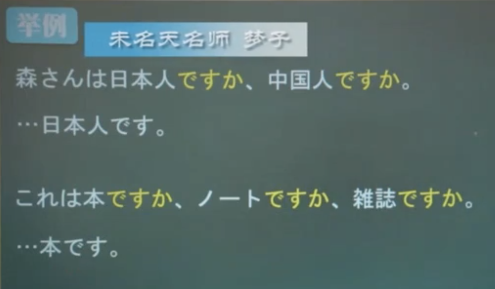
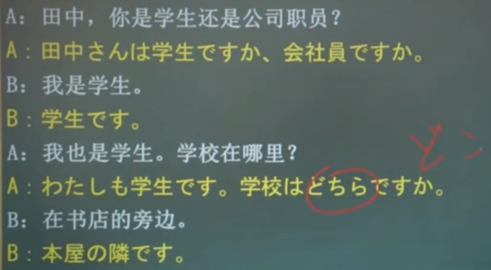

### 数字

- 0 ねい/ゼロ
- 1 いち
- 2 に
- 3 　さん
- 4 　し/よん
- 5 　ご
- 6 　ろく
- 7 　しち/なな
- 8 　はち
- 9 　きゅう/く
- 10 　じゅう

|     |              |      |            |             |                    |
| --- | ------------ | ---- | ---------- | ----------- | ------------------ |
| 100 | ひゃく　     | 1000 | せん       | 10,000      | いちまん           |
| 200 | にひゃく　   | 2000 | にせん     | 100,000     | じゅうまん         |
| 300 | さんびゃく   | 3000 | さんせん   | 1,000,000   | ひゃくまん         |
| 400 | よんひゃく   | 4000 | よんせん   | 10,000,000  | いっせんまん       |
| 500 | ごひゃく     | 5000 | ごせん     | 100,000,000 | いちおく           |
| 600 | ろっひゃく   | 6000 | ろくせん   | 9002        | きゅうせんに       |
| 700 | ななひゃく   | 7000 | ななせん   | 9020        | きゅうせんにじゅう |
| 800 | はっびゃく   | 8000 | はっせん   | 9200        | きゅうせんにひゃく |
| 900 | きゅうひゃく | 9000 | きゅうせん |             |

### 年龄

###　价格

> 〜円(えん)：日语的货币单位

- 1 円 いちえん
- 4 円 よえん
- 5 円 ごえん
- 10 円　じゅうえん
- 50 円　ごじゅうえん
- 100 円　ひゃくえん
- 500 円　ごひゃ k えん
- 1000 円　せんえん
- 10,000 円　いちまんえん
- 10,000,000 円　いっせんまんえん

> 〜はいくらですか　什么什么多少钱

> いくつ 岁
> 〜はいくらですか 多少岁

### 地点指示代词

|        | 地点指示代词 | 指示代词   | 含义　 |
| ------ | ------------ | ---------- | ------ |
| 近称   | ここ　       | 　こちら　 | 这路   |
| 中称   | そこ　       | 　そちら   | 那里   |
| 远称   | あそこ       | 　あちら   | 那里   |
| 疑问称 | どこ         | 　どちら   | 哪     |

#### 例句

1. 这里是哪里

> ここはどこですか

> 傘売り場です

2. 这里是相机部门吗

> ここはカメラ売り場ですか

> はい、カメ売り場です

### 表示方向

- こちら　---- 这个方向
- そちら　---- 那个方向
- あちら　---- 那个方向
- どちら　---- 哪个方向

> 例句 こちらへどうぞ 像这个方向走

### 表示地点

更礼貌一些

- こちら　---- 这里
- そちら　---- 那里
- あちら　---- 那里
- どちら　---- 哪里

#### 例句

1. 这里/那里是学校

> ここ・そこ・あそこ　は学校(がっこう)です
> こちら・そちら・あちら　は学校(がっこう)です

2. 你的家乡在哪里

> お国はどこですか
> お国はどちらですか

### 表示对人的敬称

1. 这位是田中先生

この人(ひと)は田中(たなか)さんです
こちらは田中(たなか)さんです

### 场所

1. 这里厕所

> ここはトイレです

2. 小李在厕所

> 李さんはトイレです

3. 银行在哪啊

> バンタはどこですか

4. 请问洗手间在哪

> お手(て)洗い(あら)[は]どこですか

## も

提示组词，“也”的意思

### 例句

1. 这个人是学生

> この人は学生です

2. 那个人也是学生

> その人も学生です

## 选择疑问句

### 例句

### ～ですか

1. 表示确定(升调 ⬆️)
   用于进一步确定对方所说的信息

> あのう、東京の地図はどこですか。
> 地図ですか。そちらです。

2. 表赞同(降调 ⬇️)
   在对方所说的内容后加[か]
   表示理解了对方所说的内容

> それはパソコンです
> パソコンですか

### 存在动词

- あります 禁止**无生命**的主体（食物、植物等）

- います 能移动的有生命的主体（人、动物等）

#### 存在句式

- 存在句

> 〜に　〜が　あります/います
> 译为：在～～(场所)有～～(事物/人)

- 所在句

> 〜は　〜に　あります/います
> 译为：～（事物/人）在～（场所）

- 例句

> 部屋(へや)に　机が　あります
> 部屋に　猫が　います

に：格组词，表示存在的场所，前面接地点有关的名词
が：主格组词，存在的的事物、人、动物作主语

- ある --　あります的简写

#### 含疑问词的疑问句

用于询问某地有某物/某人

某物 -->　何(なに)　(在询问某物中读作なに)
某人 -->　だれ(誰)

- 例句

> テレビの上に何がありますか 在电视机上的是什么

> [テレビの上に]カメラがあります (在电视机上的)是照相机

- 会議室(かいぎしつ)にだれがいますか
  在会议室里面有(是)谁

- [会議室に]森さんがいます

#### 所在句

> 〜は　 〜に　あります/います

は：提示话题  
に：格组词（表示存在的场所）

译为“～（事物/人）在～（场所）”

#### 无疑问词的疑问句回答

用[はい]或[いいえ]作答

否定：あります　ー　ありません 不在
肯定：います　　ー　いません 不在

ない：　ありません　简写

- 例句

> 本はいまの下にあにますか
> いいえ、いすの下にありません
> 　いすの上にあります

#### 含疑问词的疑问句

该句型用于询问某人/某物在某地（どこ）

〜どこにありますか
〜どこにいますか

- 例句

> スミスさんの家(いえ)はどこありますか
> 横浜(よこはま)にあります

> 彼(かれ)の魂(たましい)はもうここにはない

- もう 已经
- ここ 这里
- は 强调，加强否定
- ない 是ありません的简写形式

#### 存在句和所在句的不同

|          | 存在句                               | 所在句                                |
| -------- | ------------------------------------ | ------------------------------------- |
| 句型不同 | 〜に〜があります  〜に〜がいます | 〜は〜にあります 　〜は〜にいます |
| 含义不同 | 在某场所有某物/某人                  | 某物/某人在某场所                     |
| 组词不同 | が                                   | は                                    |
| 焦点不同 | 强调主语                             | 强调场所                              |

###
